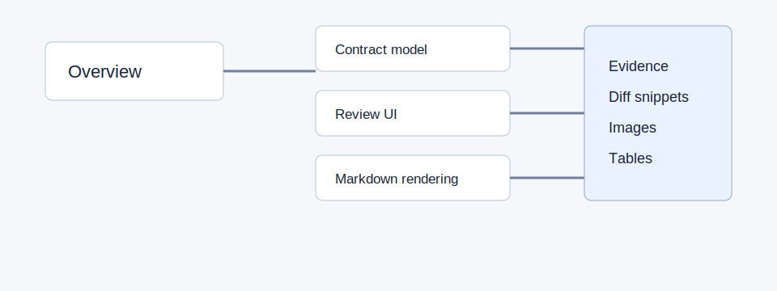

## What changed

This branch introduces paid subscriptions to the customer-facing app. It adds an internal billing state model, processes Stripe webhook events into that state, and gives support staff an admin page to inspect and manually adjust a user's billing.

## Review path

1. Billing state model
2. Stripe webhook processing
3. Admin billing UI

## Why this order

The data shape determines what every layer above can assert. The webhook handler is the only writer to that state, so it should be reviewed before any read surface depends on it. The admin UI is a read view (with a few moderated writes) and is best evaluated once the underlying invariants are settled.

## Main risks

- **Webhook idempotency** — Stripe retries can fire the same event multiple times. Double-processing must be impossible, not unlikely.
- **State transition correctness** — `canceled` is intended to be terminal. Any path that re-activates a canceled subscription should create a new row, not mutate the existing one.
- **Admin route authorization** — The new `/admin/billing/*` surface exposes destructive actions. Three layers (middleware, page, action) need to agree on the staff-role check.
- **Test coverage gaps** — Signature verification, replay, and unsupported events should each have an explicit test.

## Context used

Linked spec at `docs/specs/billing-v1.md`, the `BILLING-142` issue, and the PR description. The PR description does not explicitly cover unsupported Stripe statuses (e.g. `incomplete_expired`) — flagged in the Stripe webhook card.
